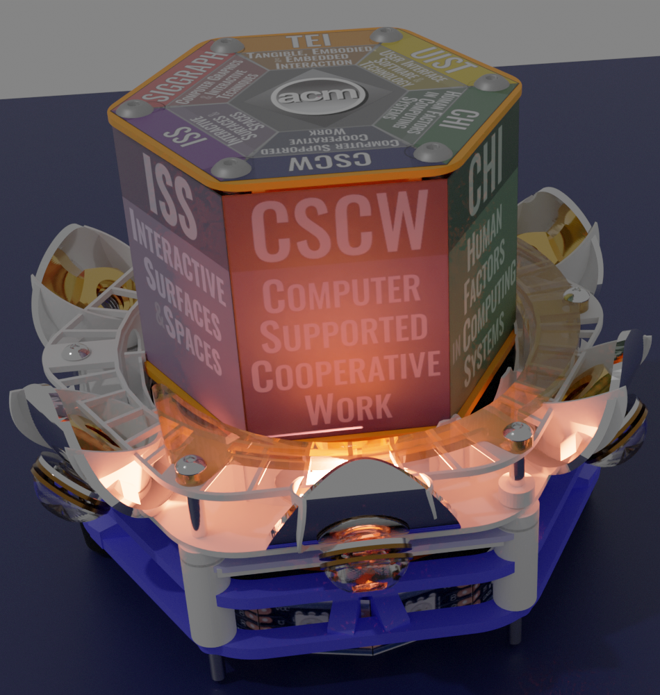
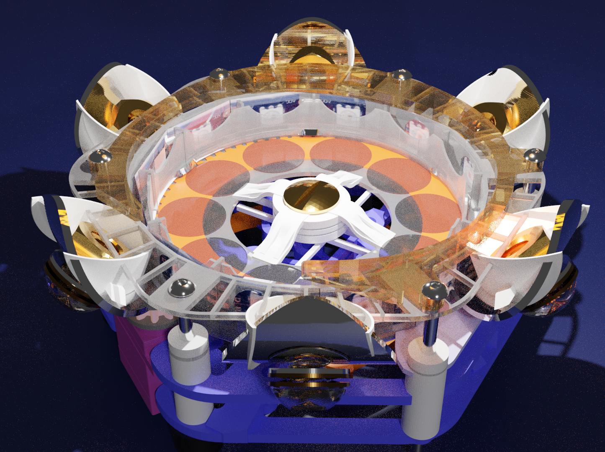
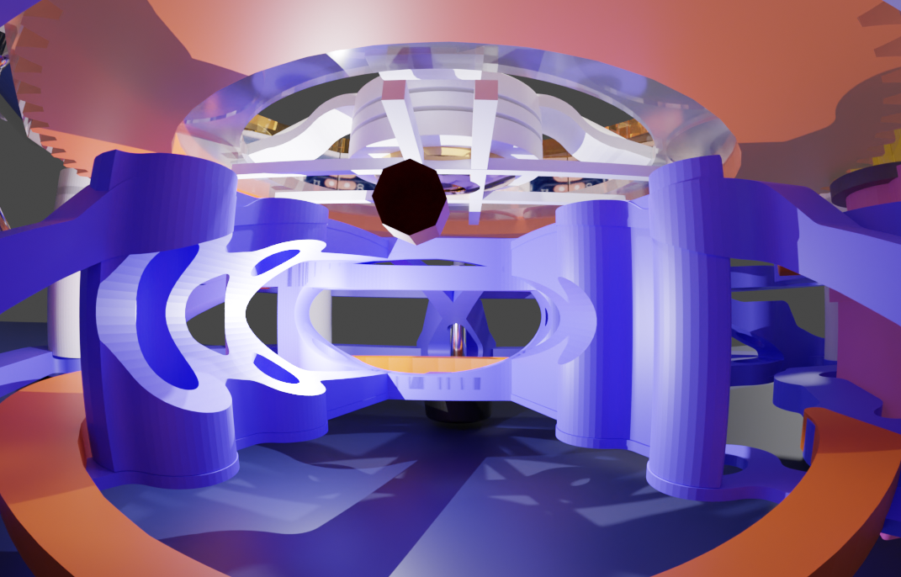

.. image:: images/hexPcb01.png
   :width: 400

*Bill of materials/constituent parts:* `parts.rst  <parts.rst>`_ | `parts.yaml <parts.yaml>`_ 

*Circuit board:*

.. image:: pcb/hextokWings03h-pcb.png
   :width: 400

.. image:: pcb/hextokWings03h-sch.png
   :width: 400

`PDF <pcb/hextokWings03h.pdf>`_,
`sch <pcb/hextokWings03h.sch>`_,
`brd <pcb/hextokWings03h.brd>`_

### end ###
