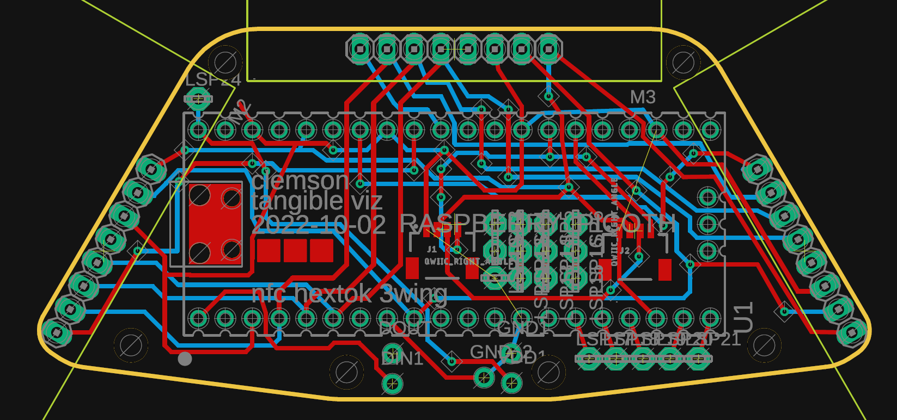

.. image:: exPlinth61c3.png
   :width: 600

.. image:: hexPcb01.png
   :width: 600

.. image:: hexPlinth70d2b.png
   :width: 600

.. image:: hexPlinth70e6b2.png
   :width: 600

*Bill of materials/constituent parts:* `parts.rst  <parts.rst>`_ | `parts.yaml <parts.yaml>`_ 

*Circuit board:*

.. image:: hextokWings03h-sch.png
   :width: 600

`PDF <hextokWings03h.pdf>`_,
`sch <hextokWings03h.sch>`_,
`brd <hextokWings03h.brd>`_

### end ###
